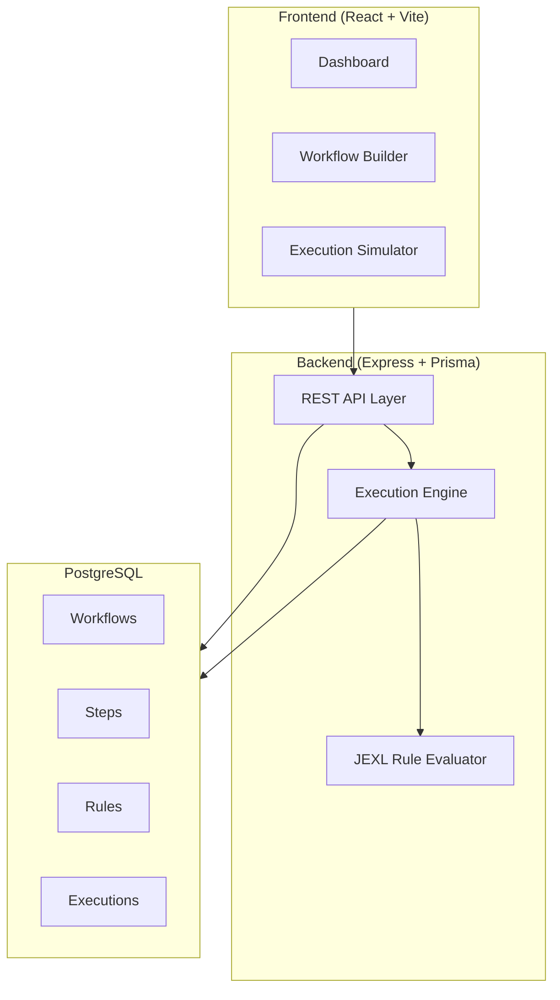

# Merchant Automation Hub - Implementation Plan

## Architecture Overview

## Phase 1: Backend Foundation
- [x] Project scaffolding (Express + TypeScript + Prisma)
- [x] Database schema design (Prisma)
- [x] Database migration
- [x] Multi-tenant middleware
- [x] Workflow CRUD APIs
- [x] Step CRUD APIs
- [x] Rule CRUD APIs

## Phase 2: Execution Engine
- [x] JEXL-based rule evaluator
- [x] Workflow execution engine
- [x] Execution logging with transactions
- [x] POST /execute endpoint
- [x] GET /executions endpoint

## Phase 3: Frontend Foundation
- [x] Vite + React + Tailwind + TanStack Router/Query setup
- [x] API client layer
- [x] Dashboard page
- [x] Workflow list view

## Phase 4: Workflow Builder UI
- [x] Create/Edit workflow form
- [x] Step management (add/edit/delete)
- [x] Rule builder UI (field, operator, value)
- [x] Visual step flow

## Phase 5: Execution Simulator
- [x] JSON payload input
- [x] Execute button with loading state
- [x] Step-by-step log visualization
- [x] Rule match highlighting
- [x] Status badges

## Phase 6: Polish
- [x] Error handling & loading states
- [x] Responsive design
- [x] Performance optimization
